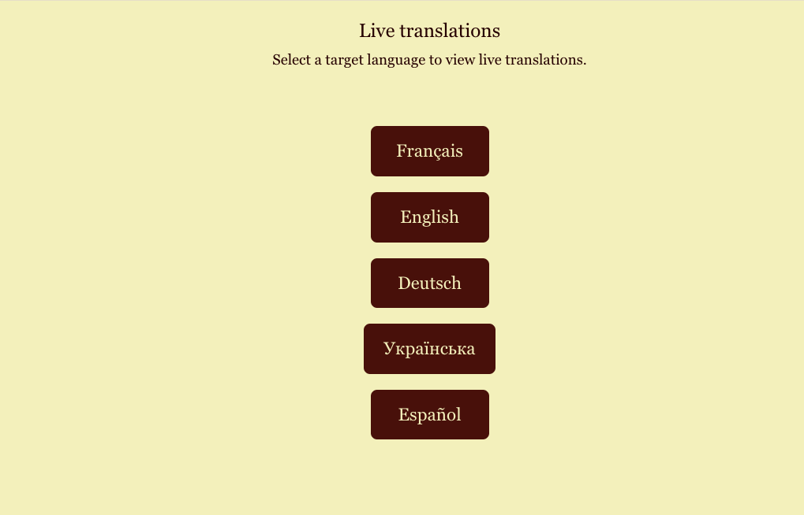

# 🎯 Real-Time Translation & Transcription Stream

A powerful, easy-to-use application for live translation and transcription using state-of-the-art AI models. Built with streaming capabilities for real-time performance.

| Main Page                            | Translation Page                              |
| ------------------------------------ | --------------------------------------------- |
|  |  |

## ✨ Features

- 🎙️ **Live Transcription**: Powered by modified Whisper model optimized for streaming
- 🌐 **Real-Time Translation**: Choose between M2M100 (Facebook AI) or DeepL API
- 🚀 **Local Server**: Run everything locally for maximum privacy and speed
- ⚡ **Auto-Updating Frontend**: Real-time updates with adjustable font size
- 🔧 **Easy Configuration**: Simple setup and customization options
- 📝 **Improved Sentence Splitting**: Better text segmentation for natural flow

## 🛠️ Installation

1. **Install using Pixi**:
   ```bash
   pixi install
   ```

2. **Run the application**:
   ```bash
   pixi run python app.py
   ```

## 🎮 Usage

1. Start the local server
2. Open your browser to access the frontend
3. Allow microphone access when prompted
4. Start speaking - see your words transcribed and translated in real-time!

## 🤝 Acknowledgments

This project builds upon the excellent work of:
- [QuentinFuxa/whisper_streaming_web](https://github.com/QuentinFuxa/whisper_streaming_web) for the core streaming functionality


---

Made with ❤️ for the open-source community

